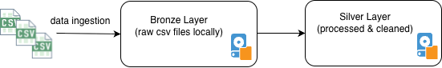

# M5 Demand Forecasting

End-to-end retail demand forecasting project using the Kaggle M5 Forecasting Accuracy dataset.

## Objective

Build an end-to-end demand forecasting solution for retail products using historical sales, calendar information, and product pricing.

The project will progressively cover:

- Data understanding and EDA
- Data Ingestion
- Data wrangling
- Time series analysis
- Feature engineering
- Baseline forecasting
- Statistical forecasting
- Machine learning forecasting
- Model evaluation
- ML engineering
- Azure deployment
- Model monitoring and drift detection
- Alerting and retraining

## Dataset

The project uses the M5 Forecasting Accuracy dataset, which contains Walmart retail sales data across products, stores, categories, calendar information, and weekly prices.

Dataset link: [m5-forecasting](https://www.kaggle.com/competitions/m5-forecasting-accuracy)

## Architecture

High level architecture at every layer in the platform - data ingestion, wrangling etc


## Project Structure

```text
m5-demand-forecasting/
│
├── data/
│   └── raw/
│
├── notebooks/
│   └── 01_basic_eda.ipynb
│
├── src/
│   └── __init__.py
│
├── tests/
│   └── __init__.py
│
├── README.md
├── pyproject.toml
└── uv.lock